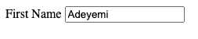
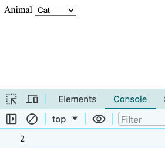

# HTML & JavaScript Cheatsheet

# Recipe

```js
//HTML Variables

//Functions

//Associate Function to Event

//Initial Loading
```

# Forms

## Input

### get

```html
<label for="firstNameInput">First Name</label>
<input
  type="text"
  id="firstNameInput"
  placeholder="enter first name"
  value="Craig"
/>

<script>
  "use strict";
  const firstNameInput = document.querySelector("#firstNameInput");
  let firstName = firstNameInput.value;
  console.log(firstName); //Craig
</script>
```

### set

```html
<label for="firstNameInput">First Name</label>
<input type="text" id="firstNameInput" placeholder="enter first name" />

<script>
  "use strict";
  const firstNameInput = document.querySelector("#firstNameInput");
  firstNameInput.value = "Adeyemi";
</script>
```



## Dropdown (Select)

### get

```html
<label for="animalDropdown">Animal</label>
<select id="animalDropdown">
  <option value="">Select...</option>
  <option value="1">Dog</option>
  <option value="2" selected>Cat</option>
  <!-- selected selects this option when page loads -->
  <option value="3">Mouse</option>
  <option value="4">Rat</option>
</select>

<script>
  "use strict";
  const animalDropdown = document.querySelector("#animalDropdown");
  let selectedAnimalId = animalDropdown.value;
  console.log(selectedAnimalId); //2
</script>
```



### set

```html
<label for="animalDropdown">Animal</label>
<select id="animalDropdown">
  <option value="">Select...</option>
  <option value="1">Dog</option>
  <option value="2">Cat</option>
  <option value="3">Mouse</option>
  <option value="4">Rat</option>
</select>

<script>
  "use strict";
  const animalDropdown = document.querySelector("#animalDropdown");
  animalDropdown.value = "3";
</script>
```


## Checkbox

## RadioButton

# Content

## Paragraph

### get

```html
<p id="messageParagraph">Meet me after school on the playground.</p>

<script>
  "use strict";
  const messageParagraph = document.querySelector("#messageParagraph");
  let message = messageParagraph.innerText;
  console.log(message); //"Meet me after school on the playground."
</script>
```

### set

```html
<p id="messageParagraph"></p>

<script>
  "use strict";
  const messageParagraph = document.querySelector("#messageParagraph");
  let message = "Message in the bottle.";
  messageParagraph.innerText = message;
  //displays message in paragraph above
</script>
```

## Div

### get

```html
<div id="messageDiv">Meet me after school on the playground.</div>

<script>
  "use strict";
  const messageDiv = document.querySelector("#messageDiv");
  let message = messageDiv.innerText;
  console.log(message); //"Meet me after school on the playground."
</script>
```

### set

```html
<div id="messageDiv"></p>

<script>
  "use strict";
  const messageDiv = document.querySelector("#messageDiv");
  let message = "Message in the bottle.";
  messageDiv.innerText = message;
  //displays message in div above
</script>
```

# Events

## Associate function with HTML Element's event

using `on[event]` property

- define function then use on[event] property of the element

```html
<button id="saveButton">Save</button>

<script>
  "use strict";
  const saveButton = document.querySelector("#saveButton");

  function save() {
    console.log("saved");
  }

  saveButton.onclick = save;
</script>
```

using `addEventListener`

- define function then for event and associate it with the function

```html
<button id="saveButton">Save</button>

<script>
  "use strict";
  const saveButton = document.querySelector("#saveButton");

  function save() {
    console.log("saved");
  }

  document.addEventListener("click", save);
</script>
```

using anonymous function inline

```html
<button id="saveButton">Save</button>

    <script>
      "use strict";
      const saveButton = document.querySelector("#saveButton");

      document.addEventListener("click", function () {
        console.log("saved");
      });
```

using anonymous arrow function inline

```html
<button id="saveButton">Save</button>

<script>
  "use strict";
  const saveButton = document.querySelector("#saveButton");

  document.addEventListener("click", () => {
    console.log("saved");
  });
</script>
```

# Build

## Droppdown (select)

```html
<!DOCTYPE html>
<html lang="en">
  <head>
    <meta charset="UTF-8" />
    <meta name="viewport" content="width=device-width, initial-scale=1.0" />
    <title>Dropdown Using JavaScript</title>
  </head>
  <body>
    <select id="animalDropdown">
      <option value="">Select...</option>
      <!-- <option value="1">Dog</option>
           <option value="2">Cat</option>
           <option value="3">Mouse</option>
           <option value="4">Rat</option> -->
    </select>
    <script>
      "use strict";

      const animalsArray = [
        { id: 1, name: "Dog" },
        { id: 1, name: "Cat" },
        { id: 1, name: "Mouse" },
        { id: 1, name: "Rat" },
      ];
      const animalDropdown = document.querySelector("#animalDropdown");

      for (const animal of animalsArray) {
        let option = document.createElement("option");
        option.value = animal.id;
        option.innerText = animal.name;
        animalDropdown.appendChild(option);
      }
    </script>
  </body>
</html>
```

## Table

```html
<table>
  <thead>
    <tr>
      <th>First Name</th>
      <th>Last Name</th>
      <th>Email</th>
      <th>IP Address</th>
    </tr>
  </thead>
  <tbody id="peopleTableBody"></tbody>
</table>

<script>
  "use strict";

  let people = [
    {
      id: 1,
      firstName: "Ezra",
      lastName: "Aiden",
      email: "e.aiden@basshall.com",
      ipAddress: "18.6.24.104",
    },
    {
      id: 2,
      firstName: "Ian",
      lastName: "Auston",
      email: "ian.auston@goldmansachs.com",
      ipAddress: "17.16.4.105",
    },
    {
      id: 3,
      firstName: "Siddalee",
      lastName: "Grace",
      email: "susa@time.com",
      ipAddress: "106.77.22.16",
    },
  ];

  // HTML element variables
  const peopleTableBody = document.querySelector("#peopleTableBody");

  //functions
  function loadPeopleTable() {
    for (const person of people) {
      buildTableRow(person);
    }
  }

  function buildTableRow(person) {
    let row = peopleTableBody.insertRow();

    let cell1 = row.insertCell();
    cell1.innerText = person.firstName;

    let cell2 = row.insertCell();
    cell2.innerText = person.lastName;

    let cell3 = row.insertCell();
    cell3.innerText = person.email;

    let cell4 = row.insertCell();
    cell4.innerText = person.ipAddress;
  }
  //event handling

  //initial loading
  loadPeopleTable();
</script>
```

## Divs (cards)

# Hide & Show

# Call API
