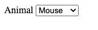

# HTML & JavaScript Cheatsheet

# Recipe

```js
//HTML Variables

//Functions

//Associate Function to Event

//Initial Loading
```

# Forms

## Input

### get

```html
<label for="firstNameInput">First Name</label>
<input
  type="text"
  id="firstNameInput"
  placeholder="enter first name"
  value="Craig"
/>

<script>
  "use strict";
  const firstNameInput = document.querySelector("#firstNameInput");
  let firstName = firstNameInput.value;
  console.log(firstName); //Craig
</script>
```

### set

```html
<label for="firstNameInput">First Name</label>
<input type="text" id="firstNameInput" placeholder="enter first name" />

<script>
  "use strict";
  const firstNameInput = document.querySelector("#firstNameInput");
  firstNameInput.value = "Adeyemi";
</script>
```


## Dropdown (Select)

### get

```html
<label for="animalDropdown">Animal</label>
<select id="animalDropdown">
  <option value="">Select...</option>
  <option value="1">Dog</option>
  <option value="2" selected>Cat</option>
  <!-- selected selects this option when page loads -->
  <option value="3">Mouse</option>
  <option value="4">Rat</option>
</select>

<script>
  "use strict";
  const animalDropdown = document.querySelector("#animalDropdown");
  let selectedAnimalId = animalDropdown.value;
  console.log(selectedAnimalId); //2
</script>
```


### set

```html
<label for="animalDropdown">Animal</label>
<select id="animalDropdown">
  <option value="">Select...</option>
  <option value="1">Dog</option>
  <option value="2">Cat</option>
  <option value="3">Mouse</option>
  <option value="4">Rat</option>
</select>

<script>
  "use strict";
  const animalDropdown = document.querySelector("#animalDropdown");
  animalDropdown.value = "3";
</script>
```



## Checkbox

## RadioButton

# Content

## Paragraph

### get

```html
<p id="messageParagraph">Meet me after school on the playground.</p>

<script>
  "use strict";
  const messageParagraph = document.querySelector("#messageParagraph");
  let message = messageParagraph.innerText;
  console.log(message); //"Meet me after school on the playground."
</script>
```

### set

```html
<p id="messageParagraph"></p>

<script>
  "use strict";
  const messageParagraph = document.querySelector("#messageParagraph");
  let message = "Message in the bottle.";
  messageParagraph.innerText = message;
  //displays message in paragraph above
</script>
```

## Div

### get

```html
<div id="messageDiv">Meet me after school on the playground.</div>

<script>
  "use strict";
  const messageDiv = document.querySelector("#messageDiv");
  let message = messageDiv.innerText;
  console.log(message); //"Meet me after school on the playground."
</script>
```

### set

```html
<div id="messageDiv"></p>

    <script>
      "use strict";
      const messageDiv = document.querySelector("#messageDiv");
      let message = "Message in the bottle.";
      messageDiv.innerText = message;
      //displays message in div above
    </script>
```

# Events

## Associate function with HTML Element's event

# Build

## Droppdown (select)

```html
<!DOCTYPE html>
<html lang="en">
  <head>
    <meta charset="UTF-8" />
    <meta name="viewport" content="width=device-width, initial-scale=1.0" />
    <title>Dropdown Using JavaScript</title>
  </head>
  <body>
    <select id="animalDropdown">
      <option value="">Select...</option>
      <!-- <option value="1">Dog</option>
           <option value="2">Cat</option>
           <option value="3">Mouse</option>
           <option value="4">Rat</option> -->
    </select>
    <script>
      "use strict";

      const animalsArray = [
        { id: 1, name: "Dog" },
        { id: 1, name: "Cat" },
        { id: 1, name: "Mouse" },
        { id: 1, name: "Rat" },
      ];
      const animalDropdown = document.querySelector("#animalDropdown");

      for (const animal of animalsArray) {
        let option = document.createElement("option");
        option.value = animal.id;
        option.innerText = animal.name;
        animalDropdown.appendChild(option);
      }
    </script>
  </body>
</html>
```

## Table

## Divs (cards)

# Hide & Show

# Call API
